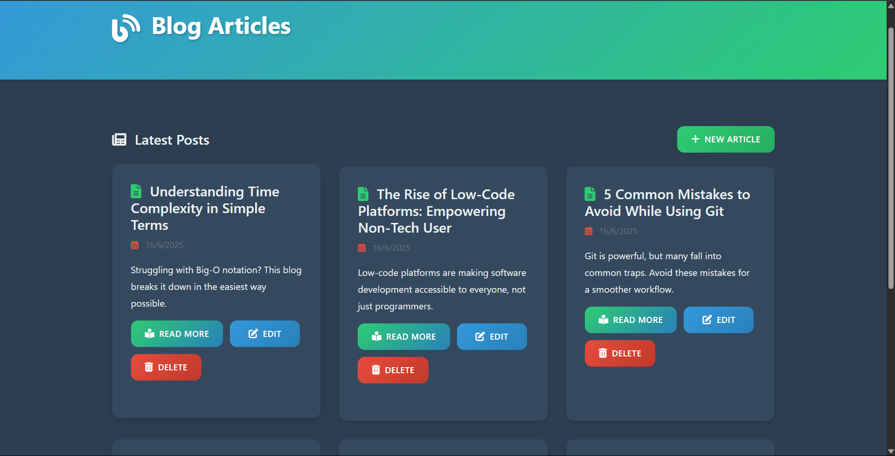

# 📝 BlogSphere — A Dynamic Blog Website

BlogSphere is a simple, full-stack blog platform built using **EJS**, **JavaScript**, and **MongoDB**, allowing users to create, read, update, and delete blog posts.

## 🌟 Features

- ✍️ Create a new blog post
- 📖 Read and view blog entries
- 🛠️ Update existing posts
- ❌ Delete blog entries
- 📜 EJS templating for clean frontend rendering
- 🔒 MongoDB for robust backend data storage

## 🚀 Tech Stack

- **Frontend**: HTML, CSS, EJS
- **Backend**: Node.js, Express.js
- **Database**: MongoDB (via Mongoose)
- **Templating Engine**: EJS

## 📁 Folder Structure

